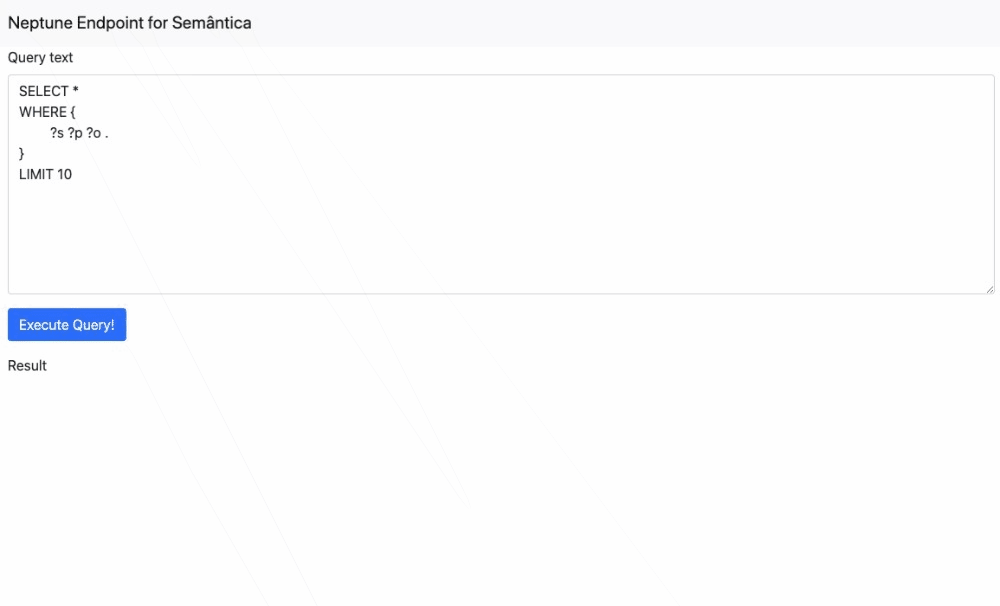

# AWS Neptune Endpoint
A endpoint to make queries SPARQL on an [AWS Neptune](https://aws.amazon.com/pt/neptune/) cluster.



## How to start
```
docker run --rm -p 5000:5000 --env-file configs/.env.local globocom/aws-neptune-endpoint
```
For how to fill the `configs/.env.local` file, look the section `Environment Variables` below.

For development purpose, you can change the `configs/.env.local` file with the correct parameters and run:
```
make run
```

## Port
Only port 5000 is exposed.

## Environment Variables
```
AWS_ACCESS_KEY: AWS access key
AWS_SECRET_ACCESS_KEY: : AWS secret access key
AWS_REGION: AWS region
AWS_NEPTUNE_HOST: AWS Neptune host (E.g: my-neptune-cluster.neptune.amazonaws.com)
AWS_NEPTUNE_PORT: 8182 (This is the default)
AWS_NEPTUNE_QUERY_TIMEOUT: 20 (This is seconds and the default)
```
